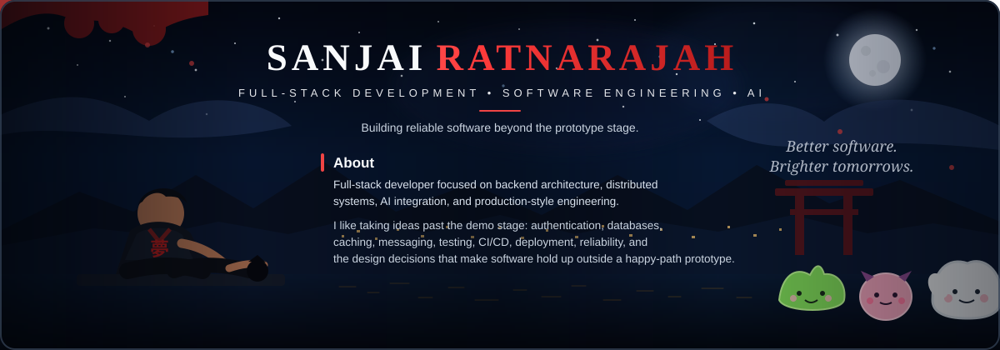

---

## Featured Projects

<table>
<tr>
<td width="50%" valign="top">

### 🧠 [Uncomplex](https://github.com/Jainoir/Uncomplex)

**AI-powered prerequisite learning maps.**

Turn any subject into an ordered roadmap of what you should understand first, with credible learning resources and shareable progress tracking.

**Stack**  
`Java 21` `Spring Boot` `React` `TypeScript` `PostgreSQL` `Redis` `Claude API` `Docker`

**Engineering highlights**  
Structured AI outputs · JWT + refresh-token rotation · distributed rate limiting · PostgreSQL advisory locks · Testcontainers · CI/CD

**[Try it live →](https://uncomplex.vercel.app)**

</td>
<td width="50%" valign="top">

### 🔥 [Rallo](https://github.com/Jainoir/Rallo)

**Social habit tracking built as a distributed system.**

Set goals, build streaks, compete with friends, and get reminded before a streak breaks.

**Stack**  
`Java 21` `Spring Boot` `Angular` `PostgreSQL` `RabbitMQ` `Redis` `Docker`

**Engineering highlights**  
Microservices · database-per-service · event-driven workflows · Testcontainers · Playwright E2E · CodeQL · Trivy · gitleaks

**[Try it live →](https://rallo-jainoir-web.onrender.com)**

</td>
</tr>
<tr>
<td width="50%" valign="top">

### 💊 [Adhera](https://github.com/Jainoir/Adhera)

**Medication adherence & caregiver escalation platform.**

A privacy-focused system for medication scheduling, patient confirmations, and reliable caregiver escalation workflows.

`Python` `FastAPI` `Angular` `PostgreSQL` `RabbitMQ` `Redis`

Transactional outbox · idempotent consumers · distributed locking · audit logging

</td>
<td width="50%" valign="top">

### 🤖 [ClassifyAI](https://github.com/Jainoir/ClassifyAI)

**Image classification experiments on CIFAR-10.**

Compares Gaussian Naive Bayes, decision trees, MLPs, and convolutional neural networks using both manual implementations and ML frameworks.

`Python` `PyTorch` `scikit-learn` `Machine Learning`

ResNet-18 feature extraction · PCA · model experiments · confusion-matrix evaluation

</td>
</tr>
</table>

---

## Toolbox

  

`Java` · `Spring Boot` · `Python` · `FastAPI` · `TypeScript` · `React` · `Angular` · `PostgreSQL` · `Redis` · `RabbitMQ` · `Docker` · `GitHub Actions`

---

## Engineering Interests

`Backend Architecture` · `Distributed Systems` · `API Design` · `AI Integration` · `Databases` · `Application Security` · `Testing` · `DevOps`

---

Build things. Understand why they work.

